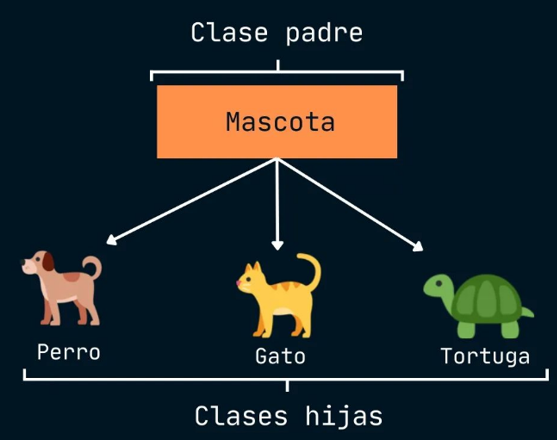
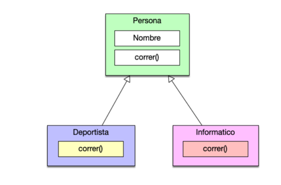

# PYTHON

## 📄 Índice

* [Introducción a Python](#introducción-a-python)
* [Variables](#variables)
* [Listas](#listas)
* [Condicionales](#condicionales)
* [Ciclo while](#ciclo-while)
* [Ciclo For](#ciclo-for)
* [Range](#range)
* [Conjuntos](#conjuntos)
* [Diccionarios](#diccionarios)
* [Tuplas](#tuplas)
* [Funciones](#funciones)
* [Decoradores](#decoradores)
* [Clases y Objetos](#Clases-y-Objetos)
* [Pilares de la POO](#Pilares-de-la-POO)

---
### Introducción a python
Python es un lenguaje de programación de alto nivel, interpretado y de código abierto, conocido por su sintaxis clara y legible, lo que lo hace fácil de aprender y usar.

> **Operadores Aritmeticos**

| Operador | Descripción | Ejemplo |
   :--- | :--- | :---|
|+  | Suma Aritmetica                | Ej: 1+10 = 11  |
|-  | Resta entre operandos          | Ej: 10-1 = 9   |
|* | Multiplicacion Entre operandos  | Ej: 10*2 = 20  |
|/  | Division entre operandos       | Ej: 10/2 = 5       |
|%  | Resto de la division           | Ej: 16%3 = 1       |
|** | Potencia de operandos          | Ej: 12**2 = 1728    |
|// | Division con resultado números enteros   | Ej: 18//5 = 3       |


> **Operadores Relacionales**

| Operador | Descripción | Uso  | 
| :--- | :--- | :--- | 
|<  | Devuelve True si el operador de la izquierda es menos que el operador de la derecha| 3 < 12  Devuelve True
|>  | Devuelve True si el operador de la izquierda es menor al operador de la derecha | 12 > 3 Devuelve True
| == | Devulve True si ambos operadores son iguales | 3 == 6 Devuelve False
| <= | Duvuelve True si el operador de la ezquierda es menos o igual al operador de la derecha | 3 <= 3 Duvuelve True
| >= |  Devuelve True si el operando de la izquierda es mayor o igual a el de la derecha | 5 >= 25 Devuelve False
| != | Devuelve True si ambos operandos no son iguales | 12 != 3 Devulve True

> Operadores Logicos

| Operador  | Descripcion  | uso
| :--- |:--- |:---:
| and  | Devuelve True si ambos operadores son True | a and b
| or | Devuelve True si algun operando es True | a or b
| not | Devuelve True si algunos de la operandos es Flase | not a 

> Print( ) y Input( )
*   `Función Print( )` se utliza para mostrar datos o mensajes en la consola
```python
 Print('Hola mundo') #Sale un Hola mundo por consola
```
*   `Función Input( )`P}Permite al usuario indroduucir texto desde el teclado
```python
 Nombre = input( )
```

## Variables 
Las variables en Py son como contenedores donde puedes almacenar datos.

Ejemplo:

```python
Nombre = 'Juan'
Edad = 25
Altura = 1.75
Fecha_de_nacimiento = '25/05/2000' 
```
Una cosa interesante sobre Py es que no necesitas especificar el tipo de datos que contendra la variable


> Algunas funciones utiles para las variables

| Funciones | Descripción |
| :--- | :---:
|.lower( )  | Convierte todos los caracteres en minúsculas
|.upper( )  | Convierte todos los caracteres en Mayúsculas
|.len( )   | Devuelve el largo de la cadena
|.strip( ) | Elimina los espacios en blanco al inicio y al final de la cadena

## Listas

Las listas son una de las estructuras de datos más fundamentales y flexibles de Py, y se puede considerar el equivalente a los arrays que se conoce de C, pero coon capacidades muy superiores.

Sintaxis: Se define utilizando corchetes [ ] y sus elementos separados por comas

Ejemplo:  Numeros = [1, 2, 3, 4, 5]

> Algunas funciones utiles para las Listas

|Funciones  | Descripción 
| :--- |:---:
| .append( ) | Añade un elemeno al final de la lista
|.remove( )  | Elimina un elemento de la lista
|.len( )     | Para encontrar el largo de la cadena 
| .extend( ) | Para extender los elementos de una lista a otra
|.sort( )    | Ordena una lista
| .count( )  | cuenta cuantas veces aparece un elemento 
|.reverse( ) | Revierte el orden de una lista
|.clear( )   | Borra todos los elemtos de una lista
|.index( )   | Obtiene el indice de un elemento

## Condicionales 

Los condicionales en Py son herramientas que te permiten controlar el flujo de ejecución de tu programa

Ejemplo: 


```python
Edad= 20
if edad >= 18:
  print('eres mayor de edad') 
else:
  print('eres menor de edad')
```

## Ciclo while 

El ciclo While es una estructura de control que permite ejecutar un bloque de codigo repetidamente mientras una condicion sea verdadera.


```python
Ejemplo

while (condicíon):
  #Bloque de codigo
```
## Clico For
El ciclo for esta diseñado para ejecutar un bloque de código una vez por cada elemento de un objeto iterable.

```python
Ejemplo

For "Variable" in "Secuencia":
  #Bloque de codigo
```

## Range

La función range en Py se utliza para generar una secuencia de números. es comunmente utilizada en ciclos For para iterar un número especifico de veces

Ejemplo: Range( Inicio, Fin, Paso)

## Conjuntos 
Un Conjutno es una colección de elementos que se caracteriza por dos propiedades principales.

`Elementos únicos:` un conjunto no puede contener elementos duplicados

`No ordenados:` Los elementos no tienen un indice, y el orden en que se almacena no se mantiene. 

Sintaxis: Se definen utilizando llaves { } o usando la función set( )

> Operaciones Clave ( MATEMÁTICAS )

|funciones | Descripción 
|:--- |:---:
|.union( ) | Union de los conjuntos
|.intersection( ) | Intersección de los conjuntos
|.difference( ) | Diferencia de los conjuntos
|.symmetric_difference( ) | Diferencia simetrica de los conjuntos
|.issubset( ) | Subconjunto de un conjunto --> Devuelve un booleano
|.issuperset( ) |Superconjunto de un conjunto --> Devuelve un booleano
|.add( ) | Añade un elemento al conjunto
|.remove( ) | Elimina un elemento del conjunto

## Diccionarios
Un diccionario es una colección desordenada, modificable e indexeada de ekementos. en lugar de usar indices númericos como las listas, los diccionarios usan claves únicas para acceder a sus valores.

```python
Ejemplo

mi_diccionario = { "Clave = valor1"
                   "clave2 = valor2"
                   "clave3 = valor3"
                 }
```

> Operaciones clave

| Funciones   | Descripción 
| :--- | :---:
|.pop( ) | Elimina elementos del diccionario
|.keys( ) | Devuelve una vista de tpdas las claves en el diccionario
|.value( ) | Devuelve una vista de todos los valores en el diccionario
|.items( ) | Devuelve una vista de todos los pares de Clave-Valor en el diccionario 
## Tuplas

Una tupla es una colección ordenada de elementos que pueden contener (Números, cadenas, listas, etc.). la principal caracteristica de las tuplas es que son inmutables, es decir, una vez creadas no se pueden modificar (Añadir, eliminar o cambiar sus valores).

`Sintaxis: `Mi_tupla = (1,2,3)
Las tuplas se definen con parentesis ( ) y los elementos separados por comas.
Para una tupla de un elemento, debes añadir una coma despues del elemento.
Ejemplo:  Tupla_un_elemento( "Manzana", )

> Metodos de tuplas

|Metodos | Descripción |
|:--- |:---:
|.count( ) | Devuelve el numero de veces que "x" aparece en la tupla
|.index( ) | Devuelve el índice de la primera aparicion de "x" en la tupla

## Funciones
Una función es un bloque de código reutilizable que realiza una tarea especifica. puede definir una función una vez y luego llamarla tantas veces como sea necesario, lo que ayuda a mantener tu código limpio y organizado.
`Sintaxis:` Definición de una función `def Nombre_de_mi_funcion():`. y para llamar a la función simplemente llamas su nombre seguido de parentesis ( )
> Funciones con parámetros Arbitarios
* A veces uno sabe de antemano cuántos parámetros necesitarás. Puedes usar *args para pasar un número arbitrario de argumentos posicionales y **kwargs para pasar un número arbitrario de argumentos nombrados.

```python
Ejemplo *args
def sumar_todos(*args):
   return sum(args)
```
```python
Ejemplo **kwargs
def mostrar_info(**kwargs)
   for clave, valor in kwargs.items( ):
      print(f'{ clave } : { valor } )
```
## Decoradores
Un decorador en Python es, en esencia, una función que toma otra función como argumento, le añade alguna funcionalidad, y devuelve una nueva función.

`Propósito:` Es una manera práctica de modificar o mejorar el comportamiento de una función existente sin tener que cambiar su código interno.

`Sintaxis:` Se aplica utilizando el símbolo @ seguido del nombre de la función decoradora, justo antes de la definición de la función que se va a decorar.

```python
Ejemplo de Decorador
def logger(func):
    def wrapper(): # Función "envoltura" que añade la lógica extra
        print(f"Ejecutando {func.__name__}") # Código ANTES
        func()                                 # Llamada a la función original
        print(f"{func.__name__} ejecutada")  # Código DESPUÉS
    return wrapper

@logger
def saludar():
    print("¡Hola, Mundo!")

# Cuando llamas a saludar(), se ejecuta la función wrapper
saludar() 
# Salida:
# Ejecutando saludar
# ¡Hola, Mundo!
# saludar ejecutada

```
## Clases y Objetos
Una clase es una plantilla o molde que define un tipo de objeto. pueden pensar en una clase como una descripcion general de un grupo de objetos que tienen propiedades y comportamientos similares.
En python definimos una clase utilizando la palabra clave **Class**, seguida del nombre de la clase.
```python
Ejemplo:
         class auto:
               pass
```
> El constructor

El método **__init__** es el constructor de la clase.  se llama automaticamente cuando se crea una nueva instancia de la clase y generalmente se usa para inicializar las propiedades del objeto.

```python
**Ejemplo**
Class auto:
   def __init__(self, marca, modelo, color):
      self.marca = marca #Propiedad de la clase
      self.modelo = modelo #Propiedad de la clase
      self.color = color #Propiedad de la clase
```
En este caso, el constructor recibe marca, modelo y color como páramentros y los asigna a la instancia del objeto.
>Propiedades y atributos

Los atributos don variables que pertenecen a la clase o a la instancia. En este ejemplo, **marca**, **modelo** y **color** son atributos de instancia, lo que significa que cada objeto Auto tendrá su propio valor de estos atributos.

```python
Class auto:
   def __init__(self, marca, modelo, color):
      self.marca = marca 
      self.modelo = modelo
      self.color = color
auto = auto('Toyota', 'corolla', rojo) #Creando una instancia de Auto
pritn(auto1.marca)
print(auto1.modelo)
print(auto1.color)
```
>Métodos

Los métodos son funciones que se definen dentro de una clase y que operan solo los objetos de esa clase. Todos los me}étodos de instancia incluyen **self** como primer parámetro, que representa la instancia actual. 

```python
Class auto:
   def __init__(self, marca, modelo, color):
      self.marca = marca 
      self.modelo = modelo
      self.color = color
   def arrancar(self):
      print(f'el {self.marca} {self.modelo} está arrancando')
   def detener(self):
      print(f'el {self.marca} {self.modelo} está detenido')
```
## Pilares de la POO
La programación Orientada a Objetos (POO) es un paradigma que organiza el código en torno a objetos, que son instancias de clases. los cuatros pilares de la POO son:
>Abstracción
>Encapsulamiento
>Herencia
>Polimorfismo

`Niveles de Protección`

**PÚBLICO:** Un atributo es público si su nombre no tiene guiones bajos al principio. Se puede acceder y modificar desde fuera de la clase.

**PROTEGIDO:** Un atributo es protegido si su nombre comienza con un guion bajo (_). Se trata de una convención que indica que el atributo no dbería ser accedido directamente desde fuera de la clase, pero sigue accesible. Es más un aviso para los desarrolladores que una restricción real.

**PRIVADO:** Un atributo es considerado privado si su nombre comienza con dos guiones bajos (__). Pyrhon lo "Renombra" internamente para hacerlo menos accesible desde fuera de la clase, pero aún puede ser accedido de forma indirecta.

```python
**EJEMPLO DE PROTECCIÓN**
class Persona:
   def __init__(self, nombre, apellido, documento):
      self.__nombre = nombre #Atributo privado
      self._apellido = apellido #Atributo protegido
      self.documento = documento #Atributo Público
```
>ENCAPSULAMIENTO

El encapsulamiento consiste en agrupar datos y métodos dentro de una clase, y controlar el acceso a ellos. En Python, podemos controlar el acceso de los atributos utilizando diferentes niveles de protección. Esto se hace principalmente para proteger los datos y prevenir que se modifiquen desde fuera de la clase sin control.

```python
#EJEMPLO
class Auto:
   def __init__(self, marca, modelo, color):
      self._marca = marca #Atributo privado
      self._modelo = modelo #Atributo privado
      self._color = color #Atributo Privado
   def arrancar(self):
      return f'El {self._marca} {self._modelo} ha arrancado.'
   def detenerse(self):
      return f'El {self._marca} {self._modelo} se ha detenido.'
   #METODO PARA CAMBIARL EL COLOR DEL AUTO
   def cambiar_color(self, color_nuevo)
      self._color = color_nuevo
```
>HERENCIA

Herencia es el mecanismo que permite a una clase tomar prestado atributos y métodos de otra clase. Esto nos permite crear nuevas clases basadas en otras ya existentes, lo que facilira la reutilización de código y la extension de funcionalidades. 



```python
#EJEMPLO DE HERENCIA

Class AutoDeportivo(Auto):
   def __init__(self, marca, modelo, color, velocidad_maxima):
      super().__init__(marca, modelo, color) #Heredamos los atributos de Auto
      self.velocidad_maxima = velocidad_maxima #Añadimos un nuevo atributo
   def mostrar_velocidad_maxima(self):
      return f'El {self.marca} {self.modelo} tiene una velocidad máxima de {self.velocidad_maxima} km/h'
```

En este ejemplo. AutoDeportivo hereda de Auto, lo que significa que tiene todos los atributos y métodos de Auto, pero además le agregamos un nuevo atributo velocidad_maxima y un método adicional mostrar_velocidad_maxima().

>POLIMORFISMO

El polimorfismo en POO significa "Muchas formas". Es la capacidad que tienen los objetos de diferentes clases de ser tratados como si fueran de la misma clase base (común) y de responder de manera diferente a los mismos métodos. Dichos de otra menera, el mismo método o función puede comportarse de diferentes maneras según el objeto que lo invoque.


Esto es especialmente útil cuando trabajmos con herencia: las clases derivadas (hijas) pueden implementar sus propios comportamientos especificos para métodos que son definidos en una clase base (padre)

```python

class Auto:
   def __init__(self, marca, modelo, color):
      self.marca = marca 
      self.modelo = modelo 
      self.color = color 
   def arrancar(self):
      return f'El {self._marca} {self._modelo} ha arrancado.'
class AutoElectrico(auto):
   def __init__(self, marca,modelo,color,bateria):
      super().__init__(marca, modelo, color): #Llamamos al constructor del auto
      self.bateria = bateria #Añadimos un atributo especifico para el AutoElectrico
   def arrancar(self):
      return f'El {self.marca} {self.modelo} eléctrico ah arrancado silenciosamente.'

#Crear un auto electrico
tesla = AutoElectrico('tesla', 'modelo S', 'Negro', '100km/h')
print(teska.arrancar())
```
>ABSTRACCIÓN

La abstracción en la Programación Orientada a Objetos (POO) significa enfocarse en las propiedades y comportamientos esenciales de un objeto, mientras se ocultan los detalles complejos o innecesarios que no son relevantes para el usuario. En otras palabras, abstraemos los detalles internos para que el usuario interactúa solo con lo necesario.

`Abstracción en el código`

Volviendo a nuestro ejemplo del auto de Python, la abstraacción es que podemos arrancar o detener el auto con métodos simples (arrancar(), detenerse() ), sin tener que saber cómo esos metodos están imprimentados internamente.

```python
#EJEMPLO
class Auto:
   def __init__(self, marca, modelo, color):
      self.marca = marca
      self.modelo = modelo 
      self.color = color
#Este método "arrancar" oculta los detalles internos de cómo arrancar el auto
   def arrancar(self):
      return f'El {self.marca} {self.modelo} ha arrancado.'
#Igualmente, "detenerse" es una abstracción de cómo se detiene el auto
   def detenerse(self):
      return f'El {self.marca} {self.modelo} se ha detenido.'
```
`¿Qué pasa cuando usamos la abstracción?`

Cuando creamos un objeto de la clase Auto y llamamos a los metodos arrancar() y detenerse(), no necesitamos saber cómo estos métodos funcionan por dentro.
Solo nos importa que el auto "arranca" o "Se detiene":

```python
mi_auto = Auto('Toyota', 'corolla', 'rojo')
print(mi_auto.arranca()) #El toyota corolla ha arrancado
print(mi_auto.detenerse()) #El Toyota corolla se ha detenido
```
Lo único que el usuario de la clase necesi ta saber es que puede llamarse el método arrancar() para arrancar el auto. No le importa cómo el código realmente hace que el auto "arranque" internamente. Esto es abstracción: estamos exponiendo una funcionalidad clara y sencilla al usuario, mientras los detalles complicados se escondejn en el código.

> ABSTRACCIÓN FORMAL

En Python, cuando hablamos de abstracción formal en términos de implementación, nos referimos al uso de clases y métodos abstractos, y para esto se usa el módulo abc (Abstract Base Classes).

* Clases abstractas: Son clases que no pueden ser instanciadas directamente. Sirven como plantillas para otras clases. Estas clases definen métodos que deben ser implementados en las clases hijas.

* Métodos abstractos: Son métodos que se declaran en una clase abstracta pero no tienen implementación. Las subclases están obligadas a sobrescribirlos y darles una implementación concreta.


